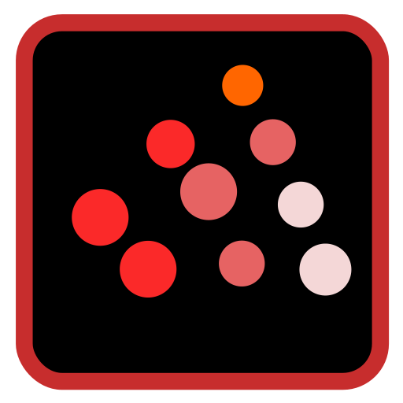

  

 

<h1 align="left">CAN-LAB</h1>

<h3 align="left">Cognitive Affective Neuroscience lab</h3>

 

<h4 align="left">Contact:</h4>

 &nbsp;  &nbsp; 

<h4 align="left">Top Languages:</h4>

 &nbsp;  &nbsp;  &nbsp;  &nbsp;  &nbsp; 

---

<h3 align="left">Public Repositories</h3>

<h4 align="left">Toolbox:</h4>

[`finish-the-job`](https://github.com/can-lab/finish-the-job)

<h3 align="left">WORKING IN PROGRESS ... ⏳</h3>
